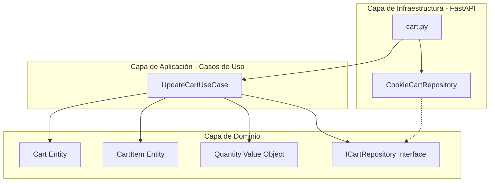

# Auditoría de Arquitectura: `src/infrastructure/routes/cart.py`

Esta auditoría analiza el archivo [cart.py](file:///home/agustin/proyectos_software/www-madypack/src/infrastructure/routes/cart.py) a través de las lentes de **Domain-Driven Design (DDD)**, **Principios SOLID** y **Arquitectura Limpia (Clean Architecture)**.

---

## 1. Análisis desde Arquitectura Limpia

En **Arquitectura Limpia**, el software se divide en capas concéntricas donde las dependencias van hacia adentro. Las rutas de un framework web (FastAPI) pertenecen a la capa externa de **Infraestructura (Frameworks & Drivers / Interface Adapters)**. 

### Hallazgos:
* **Mezcla de capas (Acoplamiento Horizontal/Vertical):** El controlador de FastAPI (`cart.py`) asume responsabilidades de múltiples capas:
  * **Capa de Infraestructura (HTTP/Web):** Rutas, lectura de cookies, renderizado de plantillas HTML, redirecciones, parseo de formularios.
  * **Capa de Casos de Uso / Aplicación:** Cooridinación del flujo (ej. si no hay cookie, inicializar con el carrito por defecto).
  * **Capa de Dominio:** Lógica de negocio dura, como calcular el total de bolsas (`sum(item.get("quantity", 0) for item in cart_items)`) y validar restricciones del negocio (`new_qty > 0`).
* **Testabilidad reducida:** Probar las reglas de negocio (ej. que la cantidad no pueda ser negativa o cero) requiere instanciar FastAPI, requests ficticios, cookies estructuradas y renderizado de templates. Esto impide pruebas unitarias puras y rápidas.

---

## 2. Análisis desde DDD (Domain-Driven Design)

### Hallazgos:
* **Modelo de Dominio Anémico / Inexistente:** 
  * Los elementos del carrito son diccionarios de Python (`dict[str, Any]`) en lugar de entidades de dominio (`Cart`, `CartItem`) o Value Objects (`Quantity`, `Money`).
  * Los tipos primitivos no aseguran la integridad del dominio. Por ejemplo, `item["quantity"]` es mutable y puede ser manipulado directamente sin reglas de validación del negocio centralizadas.
* **Fuga de Reglas de Negocio:**
  * La regla de que una cantidad debe ser un entero estrictamente mayor que cero (`new_qty > 0`) se valida dentro de un loop que recorre un formulario en la ruta HTTP.
  * Si la lógica para modificar un item cambia en el futuro (ej: aplicar descuentos, validar stock), habrá que modificar la infraestructura web.
* **Persistencia implícita en cookies:**
  * El almacenamiento se gestiona directamente serializando/deserializando JSON a una cookie. En DDD, el dominio no debería saber cómo se persisten los datos (sea una cookie, una base de datos PostgreSQL o Redis). Esto debería ser manejado por un *Repository*.

---

## 3. Análisis desde Principios SOLID

### **S - Single Responsibility Principle (SRP)**
* **Violación:** La ruta `update_cart` tiene múltiples motivos para cambiar:
  1. Si cambia la estructura del formulario HTTP.
  2. Si cambian las reglas de validación de cantidades.
  3. Si decidimos guardar el carrito en una base de datos o en la sesión de la base de datos en lugar de cookies.
  4. Si cambia el formato del JSON de persistencia.

### **O - Open/Closed Principle (OCP)**
* **Violación:** Si queremos soportar otros tipos de carritos (ej: carritos de usuarios autenticados guardados en base de datos vs carritos de invitados en cookies), debemos alterar el core del controlador. El sistema no está abierto a extensión mediante polimorfismo o abstracciones.

### **D - Dependency Inversion Principle (DIP)**
* **Violación:** La infraestructura (las rutas de FastAPI) depende directamente de los detalles de implementación (las cookies y la estructura del JSON). No existe una interfaz/abstracción que aísle la lógica del carrito de su almacenamiento físico.

---

## 4. Propuesta de Refactorización (Conceptual)

Para resolver estas deficiencias sin acoplar la lógica al framework de presentación, se sugiere estructurar el flujo de la siguiente manera:



### A. Dominio (Entities & Value Objects)
Definir tipos ricos que encapsulan las reglas de negocio:

```python
# src/domain/models/cart.py
from dataclasses import dataclass
from typing import List

class Quantity:
    def __init__(self, value: int):
        if value <= 0:
            raise ValueError("La cantidad debe ser mayor a cero.")
        self.value = value

@dataclass
class CartItem:
    id: int
    name: str
    description: str
    quantity: Quantity
    image: str

    @property
    def total_units(self) -> int:
        return self.quantity.value

class Cart:
    def __init__(self, items: List[CartItem]):
        self._items = {item.id: item for item in items}

    @property
    def items(self) -> List[CartItem]:
        return list(self._items.values())

    @property
    def total_bags(self) -> int:
        return sum(item.total_units for item in self._items.values())

    def update_quantity(self, item_id: int, quantity: Quantity) -> None:
        if item_id in self._items:
            self._items[item_id].quantity = quantity
```

### B. Abstracción del Repositorio (Dominio/Aplicación)
```python
# src/domain/repositories/cart_repository.py
from abc import ABC, abstractmethod
from src.domain.models.cart import Cart

class ICartRepository(ABC):
    @abstractmethod
    def get_cart(self) -> Cart:
        pass

    @abstractmethod
    def save_cart(self, cart: Cart) -> None:
        pass
```

### C. Caso de Uso (Aplicación)
```python
# src/application/use_cases/update_cart.py
from src.domain.repositories.cart_repository import ICartRepository
from src.domain.models.cart import Quantity

class UpdateCartUseCase:
    def __init__(self, cart_repo: ICartRepository):
        self.cart_repo = cart_repo

    def execute(self, updates: dict[int, int]) -> None:
        cart = self.cart_repo.get_cart()
        for item_id, raw_qty in updates.items():
            try:
                qty = Quantity(raw_qty)
                cart.update_quantity(item_id, qty)
            except ValueError:
                # Opcional: registrar error o ignorar según reglas
                continue
        self.cart_repo.save_cart(cart)
```

### D. Infraestructura (FastAPI / Presentación)
El controlador se limita a traducir protocolos (HTTP -> Dominio y viceversa) y delegar:

```python
# src/infrastructure/routes/cart.py
from fastapi import APIRouter, Request, Depends
from fastapi.responses import HTMLResponse, RedirectResponse
from src.infraestructura.repositories.cookie_cart_repository import CookieCartRepository
from src.application.use_cases.update_cart import UpdateCartUseCase

router = APIRouter()

@router.post("/cart/update")
async def update_cart(request: Request):
    form_data = await request.form()
    
    # 1. Adaptar entrada HTTP a tipos simples
    updates = {}
    for key, value in form_data.items():
        if key.startswith("qty_"):
            try:
                item_id = int(key.replace("qty_", ""))
                updates[item_id] = int(value)
            except ValueError:
                continue

    # 2. Inyectar dependencias y ejecutar caso de uso
    repo = CookieCartRepository(request)
    use_case = UpdateCartUseCase(repo)
    use_case.execute(updates)
    
    # 3. Preparar respuesta HTTP
    response = RedirectResponse(url="/cart/", status_code=303)
    repo.persist_to_response(response) # Persiste la cookie en la respuesta HTTP
    return response
```

---

## 5. Conclusiones y Beneficios del Refactor

1. **Aislamiento del Core de Negocio:** FastAPI y las cookies se convierten en meros detalles de implementación. Si mañana decidimos migrar a Django o almacenar el carrito en Redis/PostgreSQL, las clases `Cart`, `CartItem` y `UpdateCartUseCase` permanecerán completamente intactas.
2. **Testabilidad Robusta:** Las clases de dominio y el caso de uso se pueden probar en milisegundos con tests unitarios estándar (utilizando mocks simples para `ICartRepository`), sin dependencias de frameworks ni de requests HTTP.
3. **Mantenimiento Simplificado:** Cualquier cambio en las reglas de validación (por ejemplo, permitir un máximo de 5000 bolsas por item) se define en un único lugar en el dominio (`Quantity` o `CartItem`), evitando la dispersión de reglas de negocio por la capa de infraestructura.
